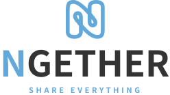

 
<h2>Ngether(엔게더) - 실시간 위치기반 공동구매 플랫폼</h2>

<h2>
<a href="https://www.notion.so/codestates/b6d94a84cd10493793b629eb74a3f35c?p=f90ea549c5754a8ebd1ca62ea3d3f7c1&pm=s">노션 링크</a>
</h2>
 

### 🚀Ngether 로컬에서 시작하기

<strong>Client</strong>

<h4 style="color:#5ad7b7"><strong>yarn install</strong></h4>

개발에 필요한 패키지들을 설치합니다.

<h4 style="color:#5ad7b7"><strong>yarn dev</strong></h4>

개발 모드로 앱을 실행합니다.
브라우저에서 https://localhost:3443으로 실행됩니다.

<h4 style="color:#5ad7b7"><strong>yarn build</strong></h4>

작업 완료 후 배포를 위한 build폴더가 생성됩니다.

<h4 style="color:#5ad7b7"><strong>https 서버 시작하기</strong></h4>

http에서는 지도 서비스를 지원하지 않습니다. https 환경에서 앱을 시작해주시기 바랍니다

mac에서 설치하기

brew install mkcert

Linux에서 설치하기

sudo apt install libnss3-tools

공통

mkcert key.pem cert.pem 입력 후 파일명 key.pem과 cert.pem으로 변경

<strong>Server</strong>

<h4 style="color:#cc6cab"><strong>EC2 서버를 사용하여 서버 배포하기</strong></h4>
<ol>
    <li>레포지토리에 변화가 생기면 Github Actions 작동</li>
    <li>프로젝트 빌드 결과물(.jar)을 S3로 전송 및 저장 <주소></li>
    <li>Amazon CodeDeploy에 배포 명령 </li>
    <li>S3에서 Amazon CodeDeploy에 프로젝트 빌드 결과물(.jar) 전달</li>
    <li>EC2 배포 및 실행</li>
</ol>

 

## 나누조 팀소개

|김형진|김은수|박경현|송현우|김연주|박지윤|최지현|
|:--:|:--:|:--:|:--:|:--:|:--:|:--:|
||||||||
|FE(팀장)|FE|FE|FE|BE|BE|BE|
|[koreadinosaur](https://github.com/koreadinosaur)|[noah-eunsoo](https://github.com/noah-eunsoo)|[Pikadev1771](https://github.com/Pikadev1771)|[SHWsgithub](https://github.com/SHWsgithub)|[yeonzzoo](https://github.com/yeonzzoo)|[parkjiyun98](https://github.com/parkjiyun98)|[Aru-slave](https://github.com/Aru-slave)|

 
## 아키텍처

---

 

## ERD
---

## Ngether 사용 예시

<strong>회원가입 및 로그인, 마이페이지</strong>

메인페이지
 

회원가입
 

로그인
 

마이페이지
 

<strong>게시물 등록, 검색, 수정</strong>

게시물 등록
 

검색
 

수정
 

삭제
 

<strong>주소록 등록, 나의 쉐어링, 찜</strong>

주소롱 등록
 

나의 쉐어링 
 

1:1 문의 등록
 

<strong>채팅리스트, 채팅방</strong>

채팅리스트, 채팅방
 

<strong>관리자 페이지</strong>

1:1 문의 답변
 

유저 정지
 

